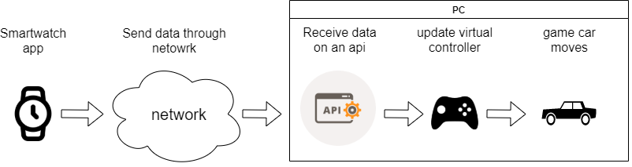
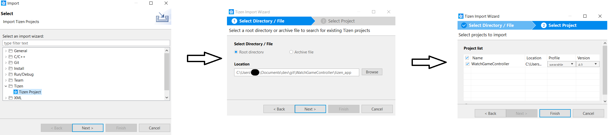
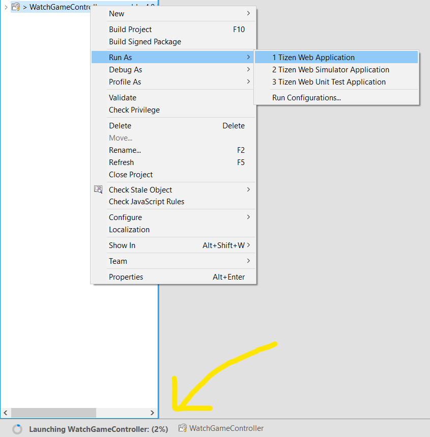
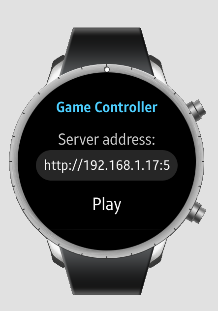
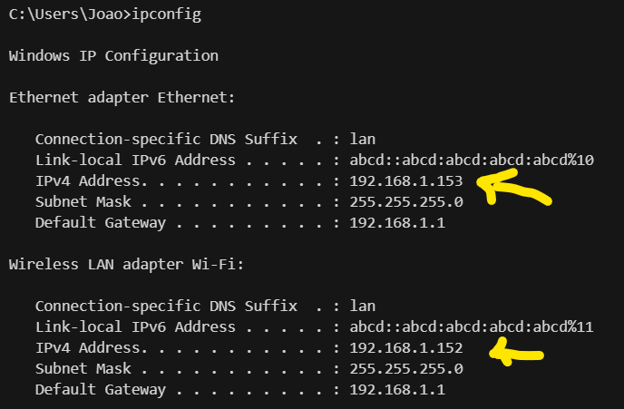
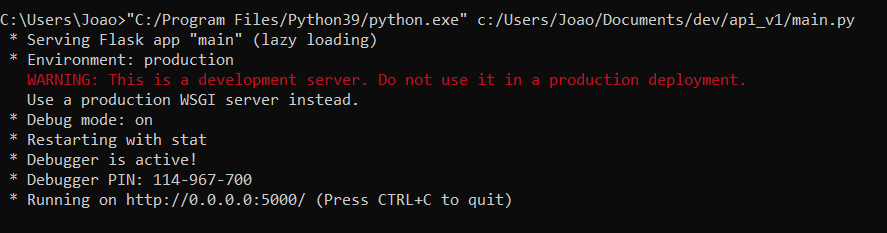
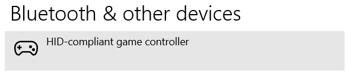
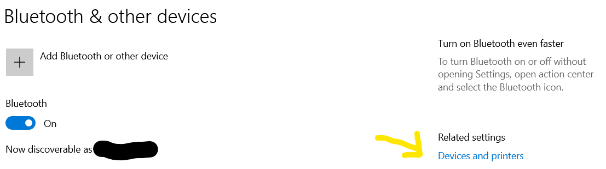
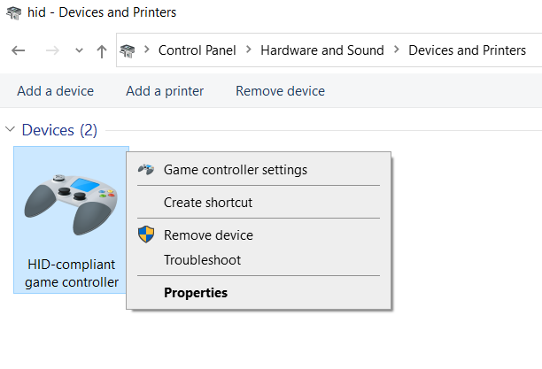
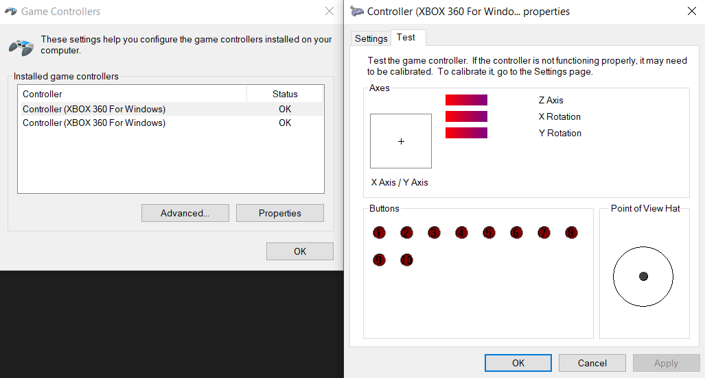

# WatchGameController

This project allows for anyone with a smartwatch with Tizes OS (for example, Samsung active 2) to control most racing games on a PC as long as both the PC and the smartwatch are connected to the same network.

## How it works

Simply put, the way it works is that the smartwatch sends the gravity sensor values, every 100ms, to the computer through an API, which in turn updates an xbox virtual controller that should control the game's vehicle.



When everything is connected and ready to play (check (how to Install)[#how-to-install]), the game should be controlled by doing the following movements (assuming the user has the watch on the wrist).

On my experience, the best starting position (although there may be variations that may be way better/more confortable), is by raising the arm to the side to be on the same level as the shoulder and moving the forearm forward, so it makes a 90º degree angle between the arm and forearm.

---- image showing that ----

 - Speed up or backwards/break:

  To speed up or down, rotate the elbow so that the forearm goes up (speed up) or goes down (go backwards/break).

  ---- image showing that ----

 - direction:

  To turn left or right rotate the elbow so the hand moves closer (left) to the user or further away (right).

  ---- image showing that ----

 And that's it. This simulates the controller thumbstick (direction) and the back triggers (speed and break) so the car reflects the user actions.

## How to install

Before cloning the project, a few things are necessary to make it work.

### Pre requisites

In order to place the app on the smartwatch, it is necessary to have on the PC some sofware:

 - Tizen studio - The software that is used to install the app on the smartwatch. Check [official documentation](https://docs.tizen.org/application/tizen-studio/setup/install-sdk/) on how to install and [configure it to work with the smartwatch](https://docs.tizen.org/application/web/get-started/wearable/first-app/#running-on-a-target-device).
 - Python - The API is written in Python.
   - With the following packages: [vgamepad](https://pypi.org/project/vgamepad/), numpy and flask.
 - ViGEmBus driver - Necessary for the API to create the virtual controller.
   - **NOTE:** It can be installed automatically when installing the vgamepad with pip install.

### Smartwatch app

After having conenction between the smartwatch and Tizen Studio ([check pre requisites](#pre-requisites), in the Tizen Studio menu, select "File > Import". Select "Tizen > Tizen Project", click "Next" and select the folder from this github project "tizen_app". Click "Next" and select the "WatchGameController" project and click "Finish" to import it. The project should appear on the project explorer of Tizen Studio and the code can be analysed/changed from there.



To run on the smartwatch, just click with the right mouse button on the project and select "Run As > Tizen Web Application" and a progress status should appear at the button showing the installation progress. Note that if the smartwatch is not correctly set up with the tizen studion, it may instead launch the emulator.



The application is fairly simple, as the user only needs to indicate the address for the api, which has a default value, but the user may need to change at least the ip. Only if the user decides to change the [API](#api) code, the endpoint and port may change as well. To know which ip the user needs to input, check [find API ip](#find-api-ip) section.



When everything is properly set up, click "start" and the sensor data is sent to the API every 100ms. The start button should change to "stop" for the user to stop sending data for whatever reason.

#### find API ip

To find the ip of the computer that is running the API, open the terminal and enter ```ipconfig``` (on Windows). Depending on the connection type, it can be the wireless or the ethernet ipv4 address. It should appear something like this:



#### Unninstalling the app from smartwatch

To unninstall the app, navigate on the smartwatch menu until the app is found. Then, long press the app until a button with a minus symbol appears on top. When the user clicks on the minus button on top of the app, the app will be unninstalled.

### API

The API only has one endpoint, which is "/api/v1/sensors" and when the API is started, a virtual xbox controller is also initiated.

To start the api, open the terminal on the API folder and execute the following command ```python3 main.py``` to start the API. Alternatively, use the full path for both the python 3 and the API, for example ```"C:/Program Files/Python39/python.exe" c:/Users/Joao/Documents/dev/api_v1/main.py```



When the smartwatch starts sending information to the API, additionall information appears on the terminal.


#### Checking the virtual controller

To check that a virtual controller was initiated, open the Windows settings menu, and select the "Devices". In there it should be visible the controller.









#### Unninstalling API

The API is just a python executable, so to stop the API just press "ctrl+C" on the terminal that is executing the API, and to "unninstall", just delete the main.py file. 

## Playing

After [installing](#how-to-install) both the smartwatch app and the API and making sure the data is being received by the API, just start the desired game and play : ). Just make sure. on the game settings, that the steering control is set to the left thumbstick and the left and right back triggers are the ones that control the speed.